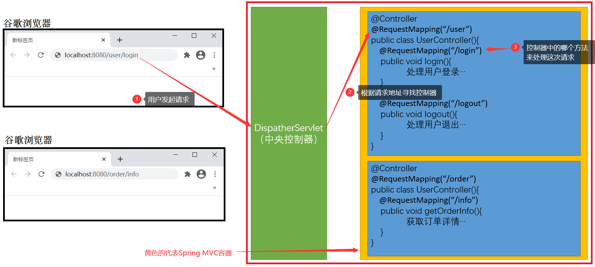
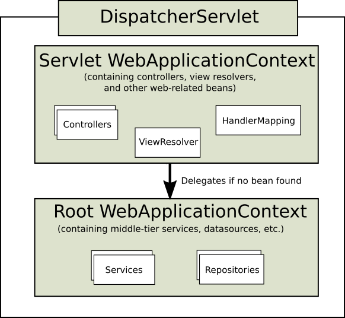

# Zero-SpringMVC
Zero-SpringMVC
# 1. 概述
## 1.1. 三层架构
### 1.1.1. 什么是三层架构
> 我们的开发架构一般都是基于两种形式，一种是C/S架构，也就是客户端/服务器，另一种是B/S架构，也就是浏览器/服务器。在JavaEE开发中，几乎全都是基于B/S架构的开发。 
> 那么在B/S架构中，系统标准的三层架构包括：用户界面层（User Interface layer）、业务逻辑层（Business Logic Layer）、数据访问层（Data access layer）。 
> 区分层次的目的就是为了解除各个模块之间的耦合关系，提高代码复用性。

### 1.1.2. 三层架构的优势
> 1. 代码结构清晰，降低层与层之间的耦合度。
> 2. 可维护性高，可扩展性高 
> 3. 利于开发任务同步进行，容易适应需求变化

### 1.1.3. 三层架构的劣势
> 1. 开发效率低，开发周期长
> 2. 降低了系统的性能 
> 3. 有时会导致级联的修改 
> 4. 增加了代码量，增加了工作量

### 1.1.4. 三层架构的组成
> 1. 表现层（User Interface layer）: Spring MVC、Struts 2
> 2. 业务逻辑层（Business Logic Layer）: Spring
> 3. 数据访问层（Data access layer）: Hibernate、MyBatis、JdbcTemplate

## 1.2. MVC
### 1.2.1. 什么是MVC
> MVC最开始是存在于桌面程序中的，全名是Model View Controller，是数据模型(model)－用户界面(view)－控制器(controller)的缩写，
> 它是一种软件设计模式。使用MVC的目的在于将M（数据模型）和V（用户界面）的实现代码分离，从而使同一个程序可以使用不同的表现形式。
> C（控制器）存在的目的则是确保M和V的同步，一旦M改变，
> V应该同步更新。

### 1.2.2. Spring MVC
> “ Spring Web MVC”通常简称为“ Spring MVC”，他是基于Servlet API构建的原始Web框架，从一开始就已包含在Spring框架中，
> 专门是做Web 开发的，Spring MVC内部也维护了一个容器，被称为Spring MVC容器，他是IOC容器的一个子类，既然是子类，
> Spring MVC容器是可以访问IOC中管理的对象的。

### 1.2.3. Spring MVC的原理
> 1. 用户发送请求至前端控制器DispatcherServlet。
> 2. DispatcherServlet收到请求调用HandlerMapping处理器映射器。
> 3. 处理器映射器找到具体的处理器(可以根据xml配置、注解进行查找)，生成处理器对象及处理器拦截器(如果有则生成)一并返回给DispatcherServlet。
> 4. DispatcherServlet调用HandlerAdapter处理器适配器。
> 5. HandlerAdapter经过适配调用具体的处理器(Controller，也叫后端控制器)。
> 6. Controller执行完成返回ModelAndView。
> 7. HandlerAdapter将controller执行结果ModelAndView返回给DispatcherServlet。
> 8. DispatcherServlet将ModelAndView传给ViewReslover视图解析器。
> 9. ViewReslover解析后返回具体View。
> 10. DispatcherServlet根据View进行渲染视图（即将模型数据填充至视图中）。
> 11. DispatcherServlet响应用户。
> 12. 如下图所示：

### 1.2.4. Spring MVC的父子容器
> 1. Spring MVC容器和Spring容器是父子关系，Spring容器是父容器，Spring MVC容器是子容器。
> 2. Spring MVC容器可以访问Spring容器中的对象，而Spring容器却访问不到Spring MVC容器中的对象。
> 3. 如下图所示： 

# 2. 功能

# 3. 使用

# 4. 其他

# 5. 参考